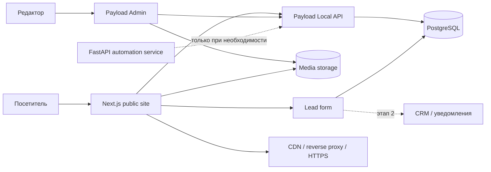

# IRMA — архитектура SEO‑сайта, CMS, стартовый дизайн и roadmap

Версия: 1.0  
Дата: 30 августа 2026  
Основание: исследование российского и международного рынка коммерческой охоты IRMA и предоставленный референс стартового дизайна.

> Этот документ можно целиком передать Codex на сервере. Главная рабочая инструкция находится в разделе «Master prompt для Codex».

---

## 1. Решение по стеку

### Рекомендуемый стартовый стек

- **Next.js (актуальная стабильная версия, App Router) + TypeScript** — публичный сайт, серверный HTML, маршрутизация, метаданные, sitemap, robots, формы и preview.
- **Payload CMS + PostgreSQL** — админка, блог, страницы, программы, кейсы, медиатека, черновики, версии, роли и публикация.
- **CSS Modules или Tailwind CSS** — выбрать один подход и не смешивать без причины. Для этого проекта предпочтителен Tailwind с дизайн‑токенами в CSS variables.
- **Docker Compose** — одинаковое окружение разработки и сервера.
- **Caddy или Nginx** — HTTPS, reverse proxy, сжатие и заголовки безопасности.
- **S3‑совместимое хранилище** для медиа в production; для локального старта допустим Docker volume.
- **Plausible/Matomo или выбранная аналитика**, Google Search Console и Яндекс Вебмастер — после согласования владельцем.

### Почему FastAPI не нужен в первой версии

FastAPI — хороший API‑фреймворк, но он не предоставляет редактору готовую CMS. Если взять чистый FastAPI, придётся отдельно проектировать и поддерживать:

- авторизацию и роли;
- интерфейс редактора;
- медиатеку;
- черновики, версии и откат;
- preview до публикации;
- плановую публикацию;
- SEO‑поля и контроль заполнения;
- аудит изменений.

Payload уже работает внутри Next.js, даёт админ‑панель, REST/GraphQL/Local API, черновики, версии и preview. Для SEO‑сайта с блогом это снижает объём собственной инфраструктуры и количество точек отказа.

### Когда добавлять Python/FastAPI

Добавлять отдельный сервис `services/automation-api` только при появлении подтверждённой задачи, например:

- сложный рекомендательный подбор экспедиции;
- импорт и нормализация прайсов из XLSX/PDF;
- интеграции с CRM/ERP, которые удобнее реализовать на Python;
- генерация документов и расчётов;
- фоновые ML/NLP‑процессы;
- автоматическая классификация контента или изображений.

Публичные страницы не должны зависеть от доступности этого сервиса. Next.js читает опубликованный контент из PostgreSQL/Payload и отдаёт полный HTML.

### Если Python принципиален с первого дня

Альтернатива — **Next.js + Wagtail CMS + PostgreSQL**. Wagtail разумнее чистого FastAPI для редакционного сайта: он уже содержит административный интерфейс и редакционный workflow. Цена альтернативы — два приложения, два набора типов и отдельный API‑контракт. Выбирать её стоит только при наличии Python‑команды или существующей Python‑инфраструктуры.

### Архитектурное решение

**Принять:** Next.js + Payload + PostgreSQL.  
**Не принимать сейчас:** отдельный FastAPI, микросервисы, Elasticsearch, Kubernetes и собственную CMS.

---

## 2. Продуктовая рамка из исследования

IRMA следует позиционировать не как каталог «охот под ключ», а как **оператора сложных охотничьих экспедиций**, который делает риски видимыми и управляемыми.

### Что на самом деле покупает клиент

- проверенный район и команда;
- реалистичную оценку условий и вероятности результата;
- понятную смету без скрытой части;
- организацию разрешений, оружия, трансферов и проживания;
- план действий при погоде, переносе, сбое логистики или изменении квоты;
- один ответственный контакт от подготовки до возвращения;
- корректное оформление трофейных документов и доставки там, где это применимо;
- снижение риска дорогой организационной ошибки.

### Рекомендуемая формулировка Hero

**Headline:** Сложные охотничьи экспедиции с управляемым риском

**Subheadline:** IRMA проверяет район и команду, собирает маршрут, разрешения и смету, готовит резервный сценарий и сопровождает охотника от первого решения до возвращения.

**Три аргумента:**

1. Район, сезон и команда проверяются до предложения программы.
2. Бюджет раскрывается по статьям: включения, исключения и возможные доплаты.
3. Документы, логистика и порядок действий при изменении условий фиксируются заранее.

**Primary CTA:** Подобрать экспедицию  
**Secondary CTA:** Посмотреть реализованные экспедиции

> До подтверждения владельцем нельзя публиковать формулировки «с 1997 года», «25+ лет», «по всему миру», «лучшие угодья», «гарантия результата» или иные измеримые утверждения.

---

## 3. Цели первой версии

MVP должен:

1. Индексироваться Google и Яндексом без выполнения клиентского JavaScript.
2. Давать редактору возможность создавать и обновлять статьи, программы и кейсы без участия разработчика.
3. Разводить поисковые интенты по отдельным полезным страницам: страна, регион, вид, конкретная программа, кейс, статья.
4. Формировать доверие через проверяемые доказательства, а не общие рекламные обещания.
5. Собирать квалифицированную заявку на консультацию.
6. Поддерживать русский язык с архитектурной готовностью к английскому.
7. Быть быстрым на мобильном интернете и доступным с клавиатуры.

Не входит в MVP:

- онлайн‑оплата и мгновенное бронирование;
- личный кабинет клиента;
- автоматический расчёт полной цены;
- marketplace с неограниченными фильтрами;
- сложная CRM внутри сайта;
- FastAPI/ML‑подбор;
- автоматический перевод без редакторской проверки.

---

## 4. Схема системы



### Принципы

- Монолит сначала: один репозиторий и одно Next.js‑приложение с Payload.
- Server Components по умолчанию; Client Components только для интерактивных элементов.
- Опубликованный SEO‑контент присутствует в исходном HTML ответа.
- Черновики доступны только авторизованным редакторам через Draft Mode.
- После публикации Payload вызывает точечную инвалидацию кэша страницы и связанных листингов.
- Админка и API закрыты от индексации.
- Контент и медиа резервируются независимо от контейнеров.

---

## 5. Рекомендуемая структура репозитория

```text
irma-site/
├─ src/
│  ├─ app/
│  │  ├─ (site)/
│  │  │  ├─ [locale]/
│  │  │  │  ├─ page.tsx
│  │  │  │  ├─ directions/page.tsx
│  │  │  │  ├─ countries/[slug]/page.tsx
│  │  │  │  ├─ regions/[slug]/page.tsx
│  │  │  │  ├─ species/[slug]/page.tsx
│  │  │  │  ├─ expeditions/[slug]/page.tsx
│  │  │  │  ├─ cases/[slug]/page.tsx
│  │  │  │  ├─ blog/[slug]/page.tsx
│  │  │  │  ├─ about/page.tsx
│  │  │  │  ├─ faq/page.tsx
│  │  │  │  ├─ selection/page.tsx
│  │  │  │  └─ contacts/page.tsx
│  │  │  ├─ layout.tsx
│  │  │  └─ not-found.tsx
│  │  ├─ (payload)/
│  │  │  ├─ admin/[[...segments]]/page.tsx
│  │  │  └─ api/[...slug]/route.ts
│  │  ├─ api/
│  │  │  ├─ preview/route.ts
│  │  │  ├─ exit-preview/route.ts
│  │  │  └─ leads/route.ts
│  │  ├─ robots.ts
│  │  ├─ sitemap.ts
│  │  ├─ manifest.ts
│  │  └─ globals.css
│  ├─ collections/
│  ├─ globals/
│  ├─ blocks/
│  ├─ components/
│  ├─ lib/
│  │  ├─ cms/
│  │  ├─ seo/
│  │  ├─ validation/
│  │  └─ analytics/
│  └─ payload.config.ts
├─ public/
│  ├─ placeholders/
│  ├─ icons/
│  └─ fonts/
├─ scripts/
│  ├─ seed.ts
│  ├─ generate-placeholders.ts
│  └─ verify-seo.ts
├─ tests/
├─ docker-compose.yml
├─ Dockerfile
├─ .env.example
└─ README.md
```

Не создавать `frontend/` и `backend/`, пока Payload встроен в Next.js: это искусственно разделит один продукт и усложнит типы, preview и публикацию.

---

## 6. Модель данных CMS

### Коллекции

#### `users`

- name, email;
- role: `admin | editor | author`;
- active;
- lastLoginAt.

Права:

- `admin` — пользователи, настройки, публикация, удаление;
- `editor` — все материалы, публикация и откат;
- `author` — создание и редактирование собственных черновиков без публикации.

#### `media`

- file;
- alt (обязательное);
- caption;
- credit/source;
- rightsStatus: `owned | licensed | generated-placeholder | unknown`;
- focalPoint;
- locale.

Файл с `rightsStatus=unknown` нельзя публиковать. Изображение‑заглушка должно иметь видимую служебную метку в админке и не использоваться как доказательство реальной экспедиции.

#### `posts`

- title, slug, excerpt;
- heroImage;
- author, categories, tags;
- publishedAt, updatedAt;
- richText content;
- relatedExpeditions, relatedSpecies, relatedCountries;
- SEO group;
- drafts, versions, scheduled publish.

#### `categories`

- name, slug, description;
- parent (опционально);
- SEO group.

#### `countries`

- name, slug, intro, map/coordinates;
- legal/logistics note;
- season summary;
- related regions, species and programs;
- SEO group.

#### `regions`

- name, slug, country;
- terrain, climate, access, season;
- related programs;
- SEO group.

#### `species`

- commonName, scientificName (если подтверждено);
- slug, description;
- regions, seasons;
- legal/ethical note;
- related programs;
- SEO group.

#### `expeditions`

- title, slug, status: `draft | active | archived`;
- country, region, species;
- durationDays;
- season text;
- difficulty: `easy | moderate | hard | expedition`;
- physicalRequirements;
- groupSize;
- startingPrice и currency — только при подтверждённой цене;
- priceNote;
- included[] / excluded[];
- itinerary[];
- accommodation;
- logistics;
- documentsAndPermits;
- trophyHandling;
- safetyAndContingency;
- gallery;
- CTA;
- SEO group.

Не использовать поле `successRate`, пока нет методики расчёта, периода, выборки и подтверждённых данных.

#### `cases`

- title, slug, date/season;
- clientGoal;
- location;
- constraints;
- preparation;
- routeAndTeam;
- whatChanged;
- result — без гарантии и без преувеличения;
- documentsAndDelivery;
- clientQuote только с разрешением;
- verifiedFacts[];
- gallery с правами;
- SEO group.

#### `testimonials`

- name или согласованная анонимизация;
- quote;
- expedition relation;
- consentRecorded;
- publishable;
- source/date.

#### `faqs`

- question, answer;
- audience;
- related entities;
- order;
- verifiedAt.

#### `redirects`

- fromPath;
- toPath;
- statusCode: 301/308;
- active.

#### `leads`

- createdAt;
- name, phone/email, preferredContact;
- destination/species, estimatedDates, groupSize;
- experienceLevel, weapon/permit question;
- message;
- consent flags;
- source page, UTM;
- status;
- spamScore.

Доступ к лидам — только администраторам. Не выводить PII в логи.

### Globals

- `siteSettings`: домен, контакты, юридические данные, social links, аналитика;
- `navigation`: header/footer;
- `homepage`: порядок блоков и выбранные сущности;
- `defaultSeo`: title template, default description, default OG;
- `trustFacts`: только подтверждённые факты с источником и датой проверки.

### Общая группа SEO‑полей

```text
seoTitle
seoDescription
canonicalOverride (редко, только editor/admin)
robotsIndex
robotsFollow
ogImage
focusQuery (внутренняя подсказка, не meta keywords)
schemaOverride (admin only; валидируемый JSON)
```

Слаг после первой публикации нельзя менять без автоматического создания redirect.

---

## 7. SEO‑архитектура

### URL‑карта

Если английская версия точно будет в ближайшем цикле, использовать симметричные префиксы:

```text
/ru/
/ru/directions/
/ru/countries/rossiya/
/ru/regions/kamchatka/
/ru/species/buryy-medved/
/ru/expeditions/kamchatka-brown-bear-spring/
/ru/cases/[slug]/
/ru/blog/[slug]/
/ru/about/
/ru/faq/
/ru/selection/
/ru/contacts/

/en/...
```

До готовности полноценного английского контента `/en/` не публиковать и не добавлять в sitemap. Не выпускать машинный перевод как индексируемую версию без редакторской проверки.

### Кластеры интентов

| Интент | Целевая страница | Пример |
|---|---|---|
| Общий коммерческий | направление/категория | охотничьи экспедиции |
| Географический | страна/регион | охота на Камчатке |
| Видовой | вид | охота на бурого медведя |
| Комбинированный коммерческий | программа | весенняя охота на медведя на Камчатке |
| Ценовой | программа + редакционный материал | стоимость охоты на… |
| Информационный | статья/FAQ | документы для охоты в… |
| Доказательный | кейс | как прошла экспедиция… |

### Правила индексируемости

- Каждая индексируемая страница имеет уникальную полезную цель, текст и доказательства.
- Фильтры и сортировки используют query parameters и по умолчанию `noindex, follow` с canonical на базовый листинг.
- Не генерировать страницы для всех комбинаций страна × вид × сезон автоматически.
- Индексировать только вручную утверждённые посадочные страницы с самостоятельной ценностью.
- Внутренние ссылки — обычные `<a href>`/`next/link`, а не обработчики клика без URL.
- 404 возвращает реальный HTTP 404; удалённая программа — 410 или 301 на точный релевантный аналог по решению редактора.
- Один URL — один canonical; canonical абсолютный и совпадает с финальным HTTPS‑URL.
- `sitemap.xml` содержит только canonical, indexable, опубликованные страницы с реальным `lastModified`.
- `robots.txt` указывает sitemap и закрывает технические пути (`/admin`, preview, внутренний поиск, служебные API), но не CSS/JS/изображения публичных страниц.
- HTML публичной страницы содержит заголовок, основной текст, ссылки, breadcrumbs и ключевые данные до гидратации.

### Метаданные

Для каждой сущности реализовать `generateMetadata`:

- уникальный title без переспама;
- description как точное резюме страницы;
- canonical;
- alternates/hreflang только для реально существующих переводов;
- Open Graph и X cards;
- `robots` из CMS;
- корректный `metadataBase`.

### Structured data

JSON‑LD должен соответствовать видимому тексту:

- главная: `Organization`, `WebSite`;
- внутренние страницы: `BreadcrumbList`;
- статья: `Article`/`BlogPosting`;
- программа: `Service`, при реальной опубликованной цене — вложенный `Offer`;
- FAQ: `FAQPage` только для вопросов и ответов, полностью видимых пользователю;
- компания/контакты: `Organization` и корректные contact points.

Не размечать выдуманные рейтинги, отзывы, цены, доступность или результаты. Наличие schema не гарантирует расширенный сниппет.

### Рендеринг и кэш

- Главная, направления, страны, виды, программы, кейсы, статьи — статический/кэшированный серверный HTML с ISR.
- Публикация/обновление в Payload вызывает `revalidatePath` или `revalidateTag` для изменённой страницы и связанных списков.
- Форма заявки — динамический Route Handler/Server Action с rate limiting и server-side validation.
- Админка, preview и пользовательские данные — динамические и `noindex`.

### Контроль качества SEO

На CI проверять:

- дубликаты title/description;
- отсутствующий H1;
- более одного H1;
- пустой alt у смысловых изображений;
- битые внутренние ссылки;
- canonical вне разрешённого домена;
- опубликованную страницу с `noindex` без явного подтверждения;
- страницу в sitemap с не‑200 ответом;
- JSON‑LD на синтаксис и согласованность основных полей;
- orphan pages без входящих внутренних ссылок.

---

## 8. Стартовый дизайн по референсу

### Визуальная концепция

**Направление:** premium expedition editorial.  
**Ощущение:** собранность, спокойная компетентность, документальность, территория и масштаб.  
**Не делать:** милитари‑магазин, агрессивную оружейную эстетику, золотой «люкс» с чрезмерным декором, постановочные доказательства.

### Палитра

```css
:root {
  --ink: #0d1511;
  --forest: #142018;
  --moss: #394a32;
  --gold: #b79a5d;
  --sand: #d7c7a8;
  --paper: #f2f0ea;
  --mist: #d8d9d5;
  --white: #ffffff;
  --danger: #9b3a2f;
}
```

Контраст текста проверять по WCAG; `--gold` не использовать для мелкого текста на светлом фоне.

### Типографика

- Заголовки: Playfair Display или лицензированный брендовый serif.
- Основной текст/UI: Montserrat.
- Шрифты хранить локально в WOFF2, создавать subset для кириллицы и латиницы.
- Основной текст: минимум 16 px, line-height 1.55–1.7.
- Не использовать капитель для длинных фраз.

### Сетка и компоненты

- Максимальная ширина контента: 1280–1360 px.
- 12 колонок desktop, 6 tablet, 4 mobile.
- Радиусы минимальные: 0–4 px; визуальный язык строгий.
- Карточки фотографические, но характеристики читаются без наведения.
- Один главный CTA на экран; вторичный визуально тише.
- Sticky header компактный и контрастный.
- Mobile: горизонтального скролла нет на ширине 320 px; меню, формы и галереи доступны с клавиатуры и touch.

### Главная страница MVP

1. **Header:** логотип, направления, виды, программы, экспедиции, о компании, блог, контакты; телефон/мессенджер; RU/EN только при наличии EN.
2. **Hero:** документальный пейзаж, позиционирование, три конкретных аргумента, два CTA.
3. **Как IRMA снижает риск:** район и команда → документы и логистика → смета → резервный сценарий → сопровождение.
4. **Направления:** Россия, Африка, Европа, другие — только реально подтверждённые.
5. **Выбранные программы:** 3–6 карточек с сезоном, длительностью, сложностью и прозрачностью цены.
6. **Реализованные экспедиции:** 3–4 проверенных кейса с задачей, ограничениями и результатом.
7. **Как строится экспедиция:** 5–7 шагов от консультации до возвращения.
8. **Подбор программы:** короткая форма‑квалификатор.
9. **О компании:** лица, роли, компетенции и подтверждённые цифры.
10. **Блог/база знаний:** документы, выбор района, подготовка, бюджет, логистика.
11. **FAQ:** страхи до оплаты.
12. **Final CTA и footer:** контакты, юридические данные, политика, согласие.

### Карточка программы

Первый экран карточки должен сразу отвечать:

- где и на какой вид;
- сезон и длительность;
- уровень физической нагрузки;
- формат группы;
- цена или причина расчёта по запросу;
- что включено и исключено;
- документы и оружие;
- кто отвечает за организацию;
- следующий шаг.

Далее: район → реалистичные ожидания → программа по дням → команда → проживание → логистика → риски и резервный план → смета → FAQ → CTA.

---

## 9. Генерация изображений‑заглушек

### Правила

1. Заглушки применяются для проверки композиции, responsive crop и производительности.
2. Они маркируются в CMS как `generated-placeholder` и заменяются до публичного запуска.
3. Нельзя использовать генерацию для отзывов, команды, документов, конкретных баз, трофейных результатов или «реализованных экспедиций».
4. На заглушках не должно быть логотипов, текста, водяных знаков и узнаваемых реальных людей.
5. Не показывать момент выстрела, кровь, раненых или мёртвых животных. Визуальный акцент — территория, подготовка, маршрут и наблюдение.
6. Сразу генерировать безопасную зону под текст и варианты кропа.

### Набор файлов

```text
public/placeholders/
├─ hero-mountain-expedition.webp       2400x1350
├─ direction-russia.webp               1200x1500
├─ direction-africa.webp               1200x1500
├─ direction-europe.webp               1200x1500
├─ direction-asia.webp                 1200x1500
├─ program-mountain.webp               1200x900
├─ program-forest.webp                 1200x900
├─ program-steppe.webp                 1200x900
├─ case-preparation.webp               1200x800
├─ case-route.webp                     1200x800
└─ about-observer.webp                 1600x1200
```

### Общий negative prompt

```text
no text, no logo, no watermark, no brand mark, no blood, no gore, no dead animal,
no firing, no military combat styling, no fantasy equipment, no distorted hands,
no duplicated people, no trophy pose, no recognizable public figure
```

### Промпт Hero

```text
Cinematic documentary photograph of a lawful mountain expedition at dawn,
one adult expedition participant seen from behind standing on a rocky ridge,
vast layered mountain range, low warm sunlight through clouds, restrained dark
forest-green and warm brass color grade, premium editorial travel photography,
realistic outdoor equipment, calm preparedness rather than action, large clean
negative space in the center-right for a Russian headline, 16:9, photorealistic.
```

### Промпт «Россия»

```text
Remote Russian mountain valley in early autumn, ibex-like wild mountain animal
observed at a respectful distance in its natural habitat, documentary wildlife
photography, cool stone and muted green palette, no people, vertical 4:5,
photorealistic, clear subject, natural weather.
```

### Промпт «Африка»

```text
Wide African savanna landscape at golden hour with a buffalo herd far in the
distance, premium conservation documentary style, restrained ochre and dark green,
no safari vehicles, no people, vertical 4:5, photorealistic, atmospheric depth.
```

### Промпт «Европа»

```text
European highland forest clearing at misty sunrise, mature red deer standing at
a respectful distance, elegant natural history photography, subdued moss green
and warm brown, no people, vertical 4:5, photorealistic.
```

### Промпт «Подготовка экспедиции»

```text
Close documentary scene of an expedition planner reviewing a paper topographic
map and route notes on a dark wooden table, compass, weatherproof notebook and
radio arranged naturally, hands only, no visible text, no weapons, warm directional
light, premium editorial realism, 3:2.
```

### Техническая обработка

- Исходники хранить отдельно от production assets.
- В сайт класть WebP/AVIF через `next/image` с заданными `width`, `height` и `sizes`.
- LCP‑изображение Hero не lazy‑load; остальные — lazy.
- Генерировать blur placeholder.
- Указывать человеческий alt, описывающий смысл, а не ключевые слова.
- Не увеличивать изображение сверх исходного разрешения.

---

## 10. Формы, безопасность и эксплуатация

### Форма подбора

Минимальные поля:

- желаемое направление/вид;
- ориентировочные даты;
- количество участников;
- опыт;
- своё оружие или аренда;
- имя;
- удобный канал связи;
- телефон/email;
- комментарий;
- согласие на обработку данных.

### Защита

- Server-side schema validation (например, Zod).
- Rate limiting по IP/сессии.
- Honeypot и/или privacy‑friendly CAPTCHA после появления спама.
- CSRF‑защита для мутаций, secure/httpOnly/sameSite cookies.
- Пароли хешируются библиотекой CMS; MFA для администраторов, если поддерживается выбранной конфигурацией.
- Upload allowlist по MIME/type, ограничение размера, случайные имена файлов.
- CSP, HSTS после проверки HTTPS, `X-Content-Type-Options`, `Referrer-Policy`.
- Секреты только в environment/secrets manager, не в Git.
- Ежедневный backup PostgreSQL и медиа; регулярная проверка восстановления.
- Админка не обязана находиться на секретном URL, но должна быть защищена аутентификацией, rate limiting и мониторингом.

Юридические тексты, согласия, правила трансграничной передачи данных и требования к хранению персональных данных должны быть проверены профильным юристом до production.

---

## 11. Roadmap реализации

### Этап 0. Подтверждение фактов и материалов — 2–5 рабочих дней со стороны бизнеса

Собрать:

- юридические данные и контакты;
- подтверждённый год начала работы;
- географию и список реально доступных программ;
- состав услуги и границы ответственности;
- шаблон сметы, включения/исключения;
- процесс разрешений, оружия и трофейных документов;
- команду, роли, биографии и фото с разрешениями;
- 5–10 кейсов по единому шаблону;
- фото/видео и подтверждение прав;
- отзывы и согласия на публикацию;
- политику переноса/отмены;
- экстренный регламент и резервные сценарии;
- список утверждений, которые можно подтвердить цифрами.

**Результат:** реестр доказательств `claim → источник → владелец → дата проверки → можно ли публиковать`.

### Этап 1. Foundation — 2–3 дня

- Создать репозиторий и Next.js App Router TypeScript app.
- Подключить Payload и PostgreSQL.
- Настроить Docker Compose и `.env.example`.
- Создать роли и базовые access rules.
- Настроить backups в staging.
- Добавить CI: typecheck, lint, test, build.

**Acceptance:** чистая установка поднимается одной документированной командой; `/admin` доступен только после входа; production build проходит.

### Этап 2. Content model и editorial workflow — 3–5 дней

- Реализовать collections/globals из раздела 6.
- Включить drafts, versions, autosave и preview.
- Настроить обязательный alt и права на изображения.
- Добавить hooks для revalidation и redirects.
- Создать seed только с явно помеченными тестовыми данными.

**Acceptance:** редактор создаёт черновик статьи, просматривает preview, публикует, откатывает версию; страница обновляется без полного ручного deploy.

### Этап 3. Design system и главная — 4–6 дней

- Ввести токены цвета, типографики, spacing и states.
- Реализовать header, footer, buttons, cards, breadcrumbs, rich text.
- Сгенерировать и подключить безопасные изображения‑заглушки.
- Собрать главную по структуре из раздела 8.
- Проверить 320/375/768/1280/1440 px.

**Acceptance:** нет горизонтального скролла; клавиатурный focus видим; Hero читабелен без изображения; layout не прыгает при загрузке медиа.

### Этап 4. SEO‑шаблоны — 5–8 дней

- Страна, регион, вид, программа, кейс, статья, FAQ.
- Metadata/canonical/hreflang/OG.
- Sitemap/robots/404/redirects.
- JSON‑LD и breadcrumbs.
- Связанные материалы и внутренние ссылки.
- Noindex/canonical для параметров фильтров.

**Acceptance:** полный основной контент есть в server HTML; sitemap содержит только 200/indexable canonical URLs; structured data проходит синтаксическую проверку.

### Этап 5. Лиды и интеграции — 2–4 дня

- Реализовать форму подбора и короткую contact form.
- Валидация, spam protection, consent logging.
- Сохранение лидов в CMS.
- Уведомления/CRM подключить после выбора получателя и политики доступа.

**Acceptance:** дубли не создаются при повторной отправке; PII не попадает в analytics или application logs; ошибки понятны пользователю.

### Этап 6. Контентный запуск — зависит от материалов

Минимум до индексации:

- главная;
- о компании;
- контакты и юридические страницы;
- 3–5 направлений;
- 6–10 программ;
- 3 подтверждённых кейса;
- 8–12 статей/FAQ по высокому коммерческому и информационному интенту;
- настоящие фото вместо заглушек на доказательных страницах.

### Этап 7. Pre‑launch — 2–3 дня

- HTTPS и редиректы одного доменного варианта.
- Проверка robots/sitemap/canonical/status codes.
- Lighthouse и реальные Core Web Vitals после запуска.
- Accessibility smoke test.
- Security headers, backup/restore drill.
- Подключение Search Console и Яндекс Вебмастера.
- Отправка sitemap.
- Проверка аналитики и целей без утечки PII.

**Definition of done:** сайт доступен по HTTPS, CMS работает, данные резервируются, индексируемые страницы отдают полный HTML и корректные статусы, у бизнеса есть инструкция редактора.

---

## 12. Master prompt для Codex на сервере

Скопировать блок ниже в новую задачу Codex внутри пустого каталога проекта. Рядом положить этот roadmap и исходный дизайн‑референс.

```text
Ты работаешь над production-проектом IRMA — SEO-сайтом оператора сложных
охотничьих экспедиций с редакционной CMS.

Сначала полностью прочитай файл IRMA_PROJECT_ROADMAP.md и проверь наличие
дизайн-референса. Не придумывай факты о компании, кейсы, цифры, отзывы,
цены, территории, лицензии, годы работы или результаты экспедиций.
Все неполученные данные помечай как TODO/UNVERIFIED в seed и не показывай
как доказанный факт на публичных страницах.

Целевая архитектура:
- актуальная стабильная Next.js с App Router и TypeScript;
- Payload CMS внутри того же Next.js приложения;
- PostgreSQL;
- Docker Compose для локального и серверного окружения;
- Caddy или Nginx перед приложением;
- Tailwind CSS + CSS custom properties для дизайн-токенов;
- публичный контент рендерится на сервере и присутствует в исходном HTML;
- Payload drafts/versions/autosave/preview;
- роли admin/editor/author;
- точечная revalidation после публикации;
- API/form routes динамические, публичные SEO-страницы статические/ISR;
- FastAPI сейчас не создавать.

FastAPI разрешено добавить только отдельным сервисом после фиксации конкретного
Python-use-case и ADR с объяснением, почему задача не решается проще в текущем
приложении. Публичный рендеринг не должен зависеть от FastAPI.

Работай фазами и после каждой фазы оставляй короткий отчёт с изменёнными файлами,
проверками и нерешёнными рисками. Не останавливайся на scaffold: доведи MVP до
рабочей локальной версии.

Фаза 1 — foundation:
1. Инициализируй Git и Next.js TypeScript App Router.
2. Установи и настрой Payload с PostgreSQL.
3. Добавь Dockerfile, docker-compose.yml, .env.example и README.
4. Не коммить секреты; добавь health checks и persistent volumes.
5. Настрой CI: install, typecheck, lint, test, build.

Фаза 2 — CMS:
Реализуй users, media, posts, categories, countries, regions, species,
expeditions, cases, testimonials, faqs, redirects, leads и globals из roadmap.
Добавь drafts, versions, preview, access control, обязательные alt/rightsStatus,
автоматический redirect при смене опубликованного slug и audit-friendly поля.
Редактор может создать статью, сохранить черновик, просмотреть, опубликовать,
запланировать публикацию и откатить версию.

Фаза 3 — публичный сайт:
Реализуй маршруты /[locale] и сущности из roadmap. До готовности английского
контента не включай /en в sitemap. Server Components используй по умолчанию;
не превращай сайт в client-side SPA. Весь значимый текст и обычные ссылки должны
быть в серверном HTML.

Собери главную:
header → hero → управление риском → направления → программы → подтверждённые
кейсы → процесс → подбор → о компании → блог → FAQ → final CTA → footer.

Используй визуальную систему референса:
темный forest/ink, moss, restrained gold, sand/paper; Playfair Display для
заголовков, Montserrat для текста; строгие карточки, документальные изображения,
минимум декоративного золота. Обеспечь читаемый fallback без фонового изображения.

Фаза 4 — placeholders:
Создай скрипт или документированный pipeline генерации изображений по промптам
roadmap. Сохраняй production-ready WebP/AVIF с размерами и blur placeholders.
Маркируй их generated-placeholder. Не генерируй лица команды, отзывы, документы,
реальные кейсы, трофейные доказательства, кровь или момент выстрела.

Фаза 5 — SEO:
1. Реализуй generateMetadata для каждой сущности.
2. Добавь абсолютные canonical, robots, sitemap, OG, hreflang только для реально
   опубликованных переводов.
3. Добавь Organization, WebSite, BreadcrumbList, Article/BlogPosting, Service и
   Offer только при наличии соответствующих видимых данных.
4. Фильтры не должны создавать бесконечные индексируемые URL.
5. Реальные 404 должны отдавать 404; redirects берутся из CMS.
6. Добавь SEO-проверки из roadmap в CI.

Фаза 6 — формы и безопасность:
Реализуй подбор экспедиции и contact form с серверной валидацией, rate limiting,
honeypot, consent flags и безопасным хранением. Не пиши PII в логи и аналитику.
Закрой /admin, preview и технические API от индексации. Добавь security headers,
upload restrictions и документированное резервное копирование PostgreSQL/медиа.

Проверки перед завершением:
- production build проходит;
- типы, lint и тесты проходят;
- публичные страницы содержат основной контент без выполнения JS;
- нет горизонтального скролла на 320 px;
- навигация и формы доступны с клавиатуры;
- sitemap содержит только 200/indexable/canonical URL;
- robots не блокирует публичные CSS/JS/images;
- canonical, title, description, H1 и JSON-LD корректны;
- изображения имеют размеры, sizes и осмысленный alt;
- Lighthouse используется как лабораторный сигнал, а не как единственная метрика;
- README описывает запуск, миграции, backup, restore, публикацию и работу редактора.

Перед началом покажи короткий план, затем начинай реализацию. Вопросы задавай только
если решение невозможно безопасно вывести из roadmap; все бизнес-факты оставляй
неопубликованными до подтверждения.
```

---

## 13. Критические запреты для реализации

- Не копировать тексты и структуру конкурента целиком.
- Не превращать главную в бесконечный каталог карточек.
- Не делать клиентский SPA‑рендеринг основного контента.
- Не создавать SEO‑страницы программно без уникальной ценности.
- Не публиковать AI‑фото как реальные экспедиции.
- Не обещать добычу или результат.
- Не скрывать состав цены за одной формулировкой «от».
- Не менять URL без redirect.
- Не использовать фальшивые отзывы, счётчики и сертификаты.
- Не запускать английскую версию как машинный дубль.
- Не добавлять отдельный backend «на будущее» без конкретной задачи.

---

## 14. Источники по техническим решениям

- [Next.js App Router](https://nextjs.org/docs/app)
- [Next.js Metadata and Open Graph](https://nextjs.org/docs/app/getting-started/metadata-and-og-images)
- [Next.js sitemap convention](https://nextjs.org/docs/app/api-reference/file-conventions/metadata/sitemap)
- [Next.js Incremental Static Regeneration](https://nextjs.org/docs/app/guides/incremental-static-regeneration)
- [Next.js production checklist](https://nextjs.org/docs/app/guides/production-checklist)
- [Payload Admin Panel](https://payloadcms.com/docs/admin/overview)
- [Payload drafts](https://payloadcms.com/docs/versions/drafts)
- [Payload versions](https://payloadcms.com/docs/versions/overview)
- [Payload preview and Next.js Draft Mode](https://payloadcms.com/docs/admin/preview)
- [Google: JavaScript SEO basics](https://developers.google.com/search/docs/crawling-indexing/javascript/javascript-seo-basics)
- [Google: crawling and indexing](https://developers.google.com/search/docs/crawling-indexing)
- [Google: structured data introduction](https://developers.google.com/search/docs/appearance/structured-data/intro-structured-data)
- [Google: URL structure](https://developers.google.com/search/docs/crawling-indexing/url-structure)
- [Яндекс: изменение структуры и дизайна сайта](https://yandex.com/support/webmaster/en/recommendations/changing-site-structure)
- [Яндекс: мобильные сайты](https://yandex.ru/support/webmaster/en/recommendations/mobile-site)
- [Яндекс: canonical URL](https://yandex.com/support/webmaster/en/robot-workings/canonical)
- [Яндекс: sitemap](https://yandex.com/support/webmaster/en/indexing-options/sitemap)
- [Яндекс: robots.txt](https://yandex.com/support/webmaster/en/controlling-robot/robots-txt)

---

## 15. Финальное решение в одном абзаце

Начинать IRMA следует как один self‑hosted Next.js App Router проект с Payload CMS и PostgreSQL: он даст редактору полноценную админку и блог, а поисковым системам — серверный HTML, понятные URL, метаданные, sitemap и быстрые страницы. FastAPI не является частью базового SEO‑стека и добавляется позже только под доказанную Python‑задачу. Визуально первая версия следует предоставленному референсу, но продаёт не абстрактный «премиум» и не каталог трофеев, а наблюдаемую компетентность: проверку, прозрачную смету, документы, логистику, резервный сценарий и реальные подтверждённые кейсы.
